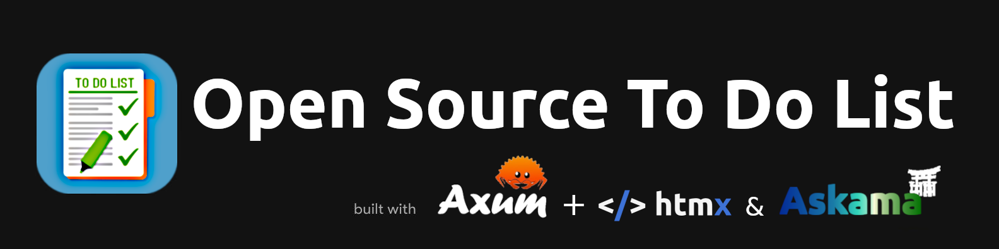
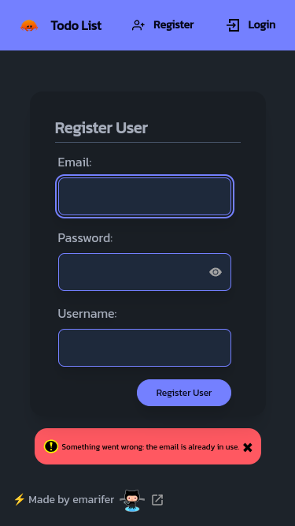
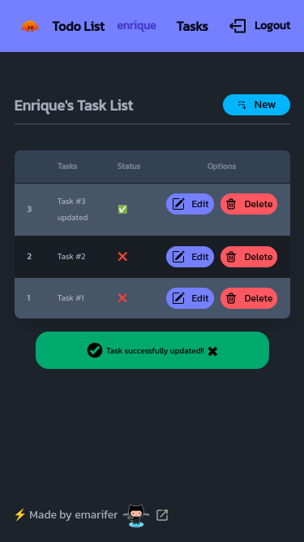
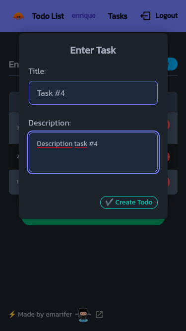
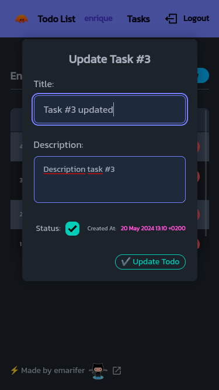
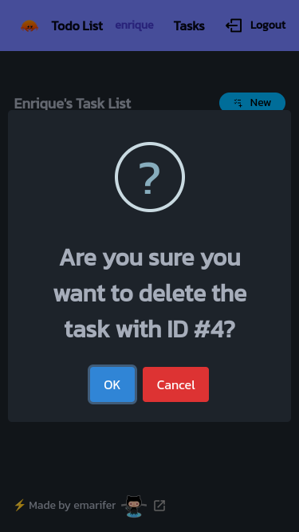
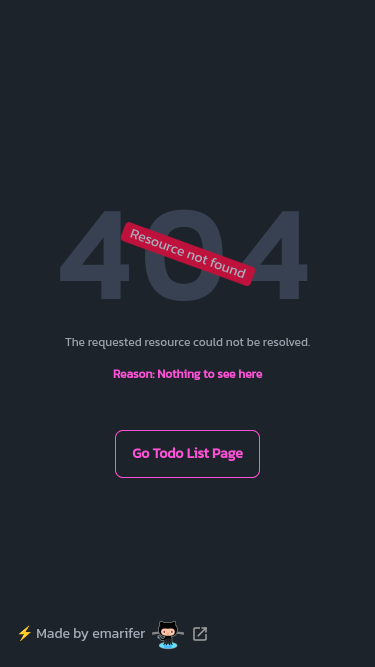
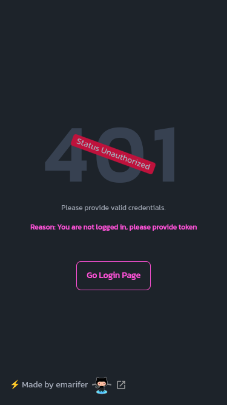
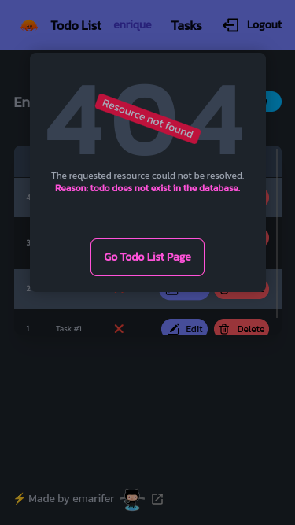

<div align="center">
  
<h1 align="center">rust-axum-askama-htmx-todoapp</h1>



<hr />

<p style="margin-bottom: 8px;">

Full stack application using Rust's Axum framework & Askama templating language with user auth management (JWT) + CRUD to a SQLite database (To Do List) and HTMX in the frontend.

</p>
  
  

</div>

>🤦 Yes, just another to-do application, but to try something new you have to start somewhere ¯\\\_(ツ)\_/¯.
  
<br />

>[!NOTE]
>***This application is an improved clone of this [repository](https://github.com/emarifer/go-echo-templ-htmx) of mine (go-echo-templ-htmx), but made in `Rust`.***

<hr />

## 🤔 What Stack have we used?

In the implementation of this application we have used the following technologies:

- ✅ **Bootstrapping**: [Rust programming language (v1.77.0)](https://www.rust-lang.org/)
- ✅ **Backend Framework**: [Axum v0.7.5 ](https://docs.rs/axum/latest/axum/)
- ✅ **Database**: [Sqlite](https://www.sqlite.org/)
- ✅ **Templating Language**: [Askama v0.12.1](https://docs.rs/askama/latest/askama/)
- ✅ **Styling**: [TailwindCSS + DaisyUI](https://tailwindcss.com)
- ✅ **Frontend interactivity**: [</>Htmx + _Hyperscript](https://htmx.org/)
  
<br />

>[!NOTE]
>***The use of [</>htmx](https://htmx.org/) allows behavior similar to that of a SPA, without page reloads when switching from one route to another or when making requests (via AJAX) to the backend. Likewise, the [_hyperscript](https://hyperscript.org/) library allows you to add some dynamic features to the frontend in a very easy way.***

---

## 🖼️ Screenshots:

<div align="center">

###### Register and Todo List pages with error & success alerts, respectively, and task creation modal dialog:

&nbsp;&nbsp;&nbsp;&nbsp;

###### Modal Task Update Dialog, Confirm Dialog, and unknown path or resource not found page (Error 404):

&nbsp;&nbsp;&nbsp;&nbsp;

###### Error page 401 (Status Unauthorized) and task update modal dialog showing that the resource is no longer in the DB:

&nbsp;&nbsp;

</div>

---

## 👨‍🚀 Getting Started

#### How to build for production

Besides the obvious prerequisite of having Rust on your machine, you must have `cargo watch` installed for hot reloading when editing code.

On the other hand, since we use a SQL database (`Sqlite3`), you must have `SQLX-CLI` installed which will allow you to build the database and perform migrations. You can install it (with the necessary `feature` for `Sqlite`) with the command:

```
$ cargo install sqlx-cli -F sqlite
```

Next, you can build the database and perform the migrations that generate the `users` and `todos` tables. Make sure that the `migrations` folder is present (which contains the necessary migrations) and the `.env` file that explains the `DATABASE_URL` environment variable. To do this, you must execute these commands:

```
$ sqlx database create # generates the DB
$ sqlx migrate run # generates migrations. (`sqlx migrate revert` to reverse migrations)
```

Before compiling the binary, you will have to regenerate the CSS. To do this, go to the `tailwind` folder and run the following (you must have `Node.js` installed):

```
$ cd tailwind && npm run build-css-prod
```

Build the binary file and run it with the command:

```
$ cargo build --release && ./target/release/rust-axum-askama-htmx # Ctrl + C to stop the application
```

#### Build for development

If what you want is to edit the code, it will be more convenient to activate hot reload:

```
$ cargo watch -x run -w src -w assets -w templates
```

If you also want to modify the CSS of the templates, it will be useful to activate the `watch` mode of Tailwindcss, executing the command inside the `tailwind` folder (you need to have `Node.js` installed):

```
$ npm run watch-css # minify for production: npm run build-css-prod
```

---

### Happy coding 😀!!